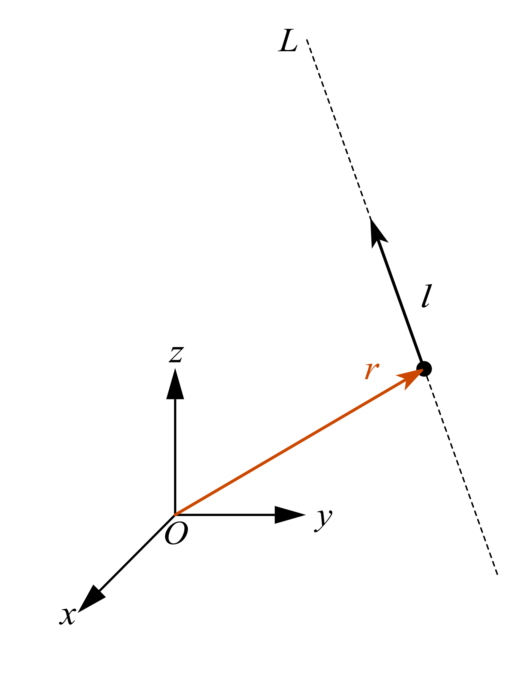
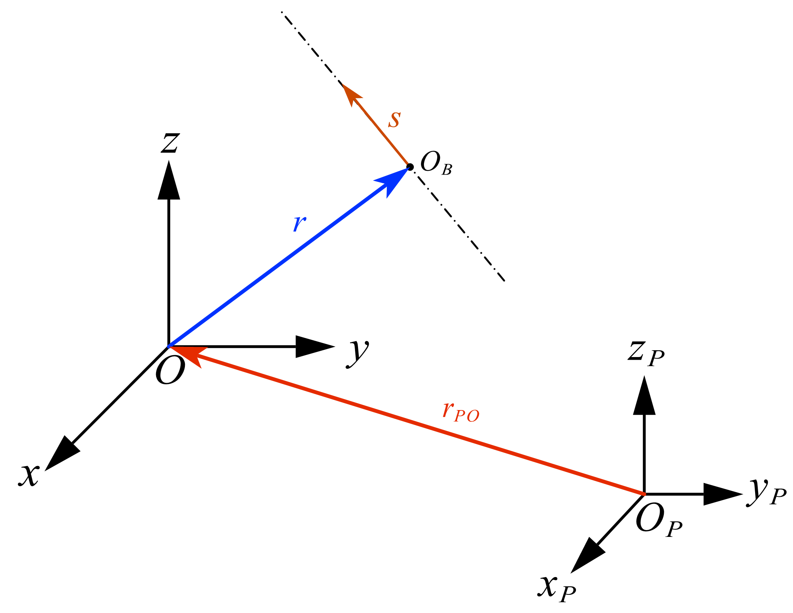
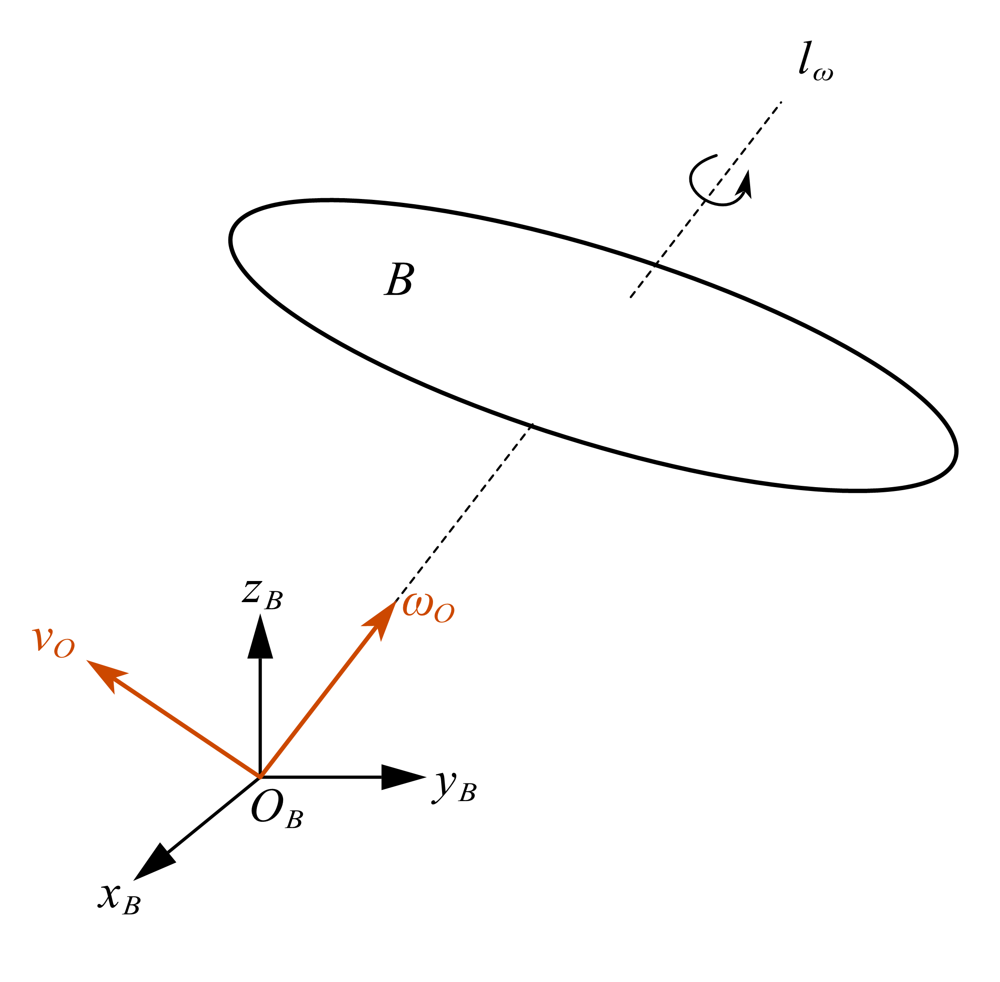
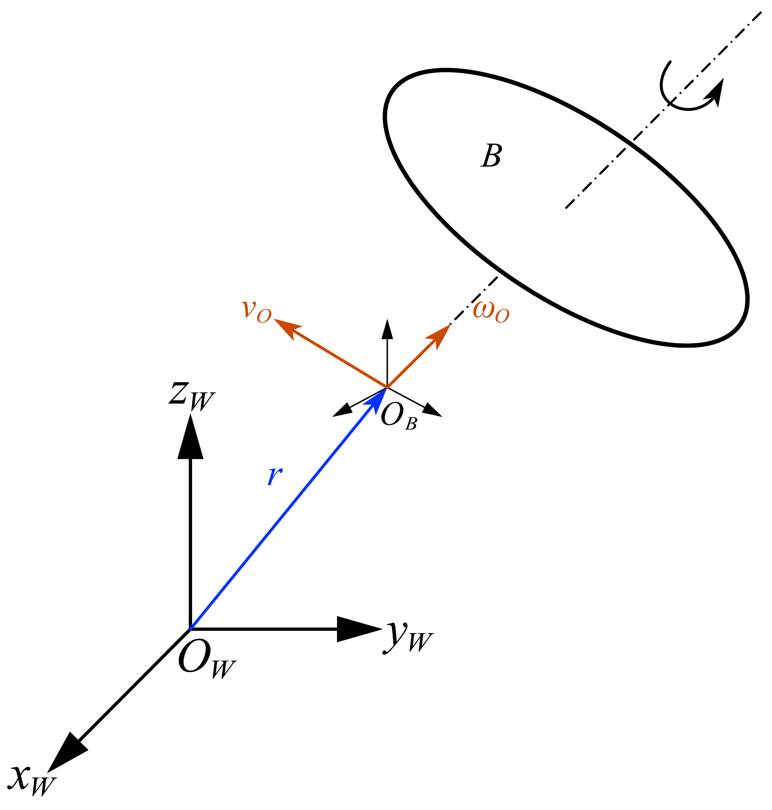
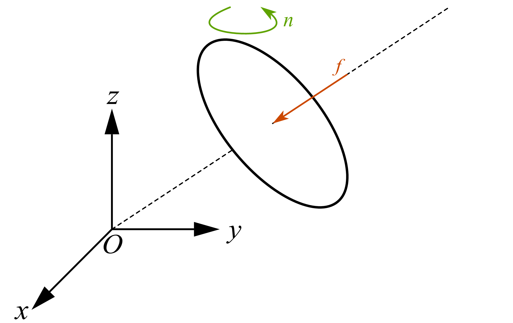
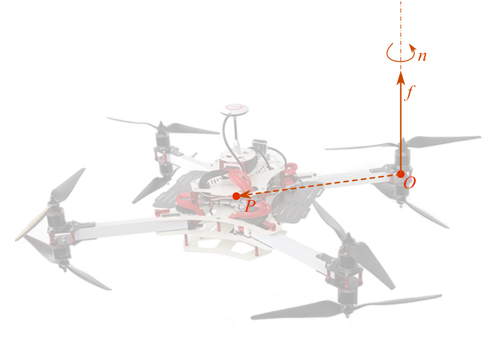

## 2.1-旋量几何基础
### (1).线矢量
在三维欧氏空间中，一条有向直线不仅具有方向，还具有相对于坐标原点的位置。
因此，仅用一个三维方向向量并不能完整描述一条空间直线。

设空间中一条直线经过点 $P$，其位置向量为 $r\in\mathbb{R}^3$，
直线的方向向量为$l\in\mathbb{R}^3, l\neq 0$，定义向量

$$
l_0=r\times l
$$

其中，$l_0$ 称为直线 $l$ 关于坐标原点的**矩向量**（moment vector）。
于是，可以将空间直线表示为一个六维向量

$$
L=
\begin{pmatrix}
l\\
l_0
\end{pmatrix}
=
\begin{pmatrix}
l\\
r\times l
\end{pmatrix}
\in\mathbb{R}^6.
$$

我们将其称为直线的**线矢量**。

### (2).Plücker 坐标

对于空间直线的线矢量

$$
L=
\begin{pmatrix}
l\\
l_0
\end{pmatrix}
=
\begin{pmatrix}
l\\
r\times l
\end{pmatrix},
$$

其中 $l$ 为直线的方向向量，$l_0$ 为直线关于坐标原点的矩向量，则六个分量

$$
(l,l_0)
$$

称为空间直线的 **Plücker 坐标**。

由于

$$
l\cdot l_0
=
l\cdot(r\times l)
=
0,
$$

Plücker 坐标满足约束

$$
l\cdot l_0=0.
$$

同时，对于任意非零标量 $\lambda$，

$$
(l,l_0)
\sim
(\lambda l,\lambda l_0),
$$

二者表示同一条空间直线。因此，Plücker 坐标本质上是五维射影空间 $\mathbb{P}^5$ 中满足上述约束的齐次坐标。

### (3).Klein 型
设线矢量 $L_1$、$L_2$ 为六维向量空间 $\mathbb{R}^6$ 中的元素，$l_1$、$l_2$ 与 $l_{10}$、$l_{20}$ 分别表示两个线矢量的姿态向量和对坐标原点的矢矩，则对于三维空间中的任意线矢量 $L_1$、$L_2$，Klein 型可表示为

$$
Kl(L_1,L_2)=l_1\cdot l_{20}+l_2\cdot l_{10}
$$

对于三维空间中的任意线矢量 $L$，Klein 型对应的二次型为

$$
Kl(L,L)=2l\cdot l_0=0
$$

该式即为由 Klein 型的二次型定义的线矢量的**自互易特性**。同时，可将上述视为五维射影空间中的二阶约束，因此该式同时定义了五维射影空间中的**超二次曲面**，又称为 **Klein 二次曲面**

### (4).旋量

在线矢量的基础上引入**旋距**（pitch），即可得到旋量。设旋量 $S\in\mathbb{R}^6$ 表示为

$$
S=
\begin{pmatrix}
s\\
s_0
\end{pmatrix}
=
\begin{pmatrix}
s\\
r\times s+hs
\end{pmatrix}
$$

其中，$s$ 为旋量的主部，表示旋量轴线方向；$s_0$ 为副部；$r$ 为轴线上任意一点的位置向量；$h$ 为旋距。

旋距可由主部与副部确定：

$$
h=\frac{s\cdot s_0}{s\cdot s}
$$

旋量轴线上距坐标原点最近一点的位置向量为

$$
r_0=\frac{s\times s_0}{s\cdot s}
$$

当坐标原点由 $O$ 变换至 $P$ 时，旋量主部 $s$ 保持不变，副部变换为

$$
s_P=s_0+r_{PO}\times s
$$

其中，$r_{PO}$ 为从新原点 $P$ 指向原原点 $O$ 的位置向量。由此可知，旋量的副部随坐标原点变化，而旋距 $h$ 保持不变。

## 2.2-空间速度向量

自由空间内有一个刚体$B$，该刚体做空间内自由刚体运动。我们根据刚体运动的性质，将其分解为以速度$v_O$平动和绕着某个轴做转动和绕着过刚体的一个旋转轴$l_{\omega}$做旋转，该旋转轴相对于刚体的位置固定，并且随着刚体一起平动。我们在该刚体轴中找到一个点$O_B$作为刚体固连坐标系的原点，并且将速度矢量$v_O$和角速度矢量$\omega_O$固定在一点$O_B$上。如图所示：

到这里，我们已经用两个量描述了刚体 $B$ 的瞬时运动：参考点 $O_B$ 的线速度 $v_O$，描述刚体的平移；角速度 $\omega_O$，描述刚体的转动。

更重要的是，这两个量合在一起就足以确定刚体上任意一点的瞬时速度。对于刚体上的任意一点 $P$，都有

$$
v_P=v_O+\omega_O\times r_{OP},
$$

其中，$r_{OP}$ 表示点 $P$ 相对于参考点 $O_B$ 的位置向量。

因此，从瞬时运动的角度看，一个刚体的运动可以由角速度 $\omega_O$ 和参考点的线速度 $v_O$ 共同刻画。三维空间中的角速度和线速度各包含 3 个分量，因此刚体的瞬时运动可以统一表示为一个 6 维向量：

$$
\hat v=
\begin{pmatrix}
\omega_O\\
v_O
\end{pmatrix}
\in\mathbb{R}^6.
$$

我们称 $\hat v$ 为刚体 $B$ 的**空间速度向量**。

!!! note "命题：空间速度向量为旋量"

    如图所示，$\{W\}$ 为地面惯性参考坐标系，刚体 $B$ 在空间中运动，其固连坐标系原点为 $O_B$。
    $O_B$ 在 $\{W\}$ 中的位置向量为 $\mathbf r$，其平动速度和刚体角速度分别为
    $\mathbf v_O$ 和 $\boldsymbol{\omega}_O$，二者均附着于 $O_B$。
    
    

    定义空间速度向量

    $$
    \mathbf V_O=
    \begin{bmatrix}
    \boldsymbol{\omega}_O\\
    \mathbf v_O
    \end{bmatrix}.
    $$

    求证：当 $\boldsymbol{\omega}_O\neq 0$ 时，$\mathbf V_O$ 为有限旋距运动旋量。

    **证明**

    将 $\mathbf v_O$ 分解为平行和垂直于 $\boldsymbol{\omega}_O$ 的两部分：

    $$
    \mathbf v_O
    =
    \mathbf v_\perp
    +
    h\boldsymbol{\omega}_O,
    \qquad
    h=
    \frac{\boldsymbol{\omega}_O^T\mathbf v_O}
    {\|\boldsymbol{\omega}_O\|^2}.
    $$

    因而

    $$
    \mathbf v_\perp
    =
    \mathbf v_O
    -
    h\boldsymbol{\omega}_O.
    $$

    若 $\mathbf V_O$ 为旋量，则应存在某一位置向量 $\boldsymbol{\rho}$，使

    $$
    \mathbf v_\perp
    =
    \boldsymbol{\rho}\times\boldsymbol{\omega}_O.
    $$

    由于 $\boldsymbol{\rho}$ 仅由
    $\boldsymbol{\omega}_O$ 和 $\mathbf v_O$ 构造，设

    $$
    \boldsymbol{\rho}
    =
    k(\boldsymbol{\omega}_O\times\mathbf v_O).
    $$

    则由向量三重积，

    $$
    \boldsymbol{\rho}\times\boldsymbol{\omega}_O
    =
    k\left[
    \|\boldsymbol{\omega}_O\|^2\mathbf v_O
    -
    (\boldsymbol{\omega}_O^T\mathbf v_O)\boldsymbol{\omega}_O
    \right].
    $$

    而

    $$
    \mathbf v_\perp
    =
    \frac{1}{\|\boldsymbol{\omega}_O\|^2}
    \left[
    \|\boldsymbol{\omega}_O\|^2\mathbf v_O
    -
    (\boldsymbol{\omega}_O^T\mathbf v_O)\boldsymbol{\omega}_O
    \right].
    $$

    比较得

    $$
    k=
    \frac{1}{\|\boldsymbol{\omega}_O\|^2},
    \qquad
    \boldsymbol{\rho}
    =
    \frac{\boldsymbol{\omega}_O\times\mathbf v_O}
    {\|\boldsymbol{\omega}_O\|^2}.
    $$

    因此

    $$
    \boxed{
    \mathbf v_O
    =
    \boldsymbol{\rho}\times\boldsymbol{\omega}_O
    +
    h\boldsymbol{\omega}_O
    }.
    $$

    这正是有限旋距旋量的标准形式，故

    $$
    \boxed{
    \mathbf V_O=
    \begin{bmatrix}
    \boldsymbol{\omega}_O\\
    \mathbf v_O
    \end{bmatrix}
    }
    $$

    为有限旋距运动旋量。证毕。

## 2.3-空间力向量

在前面我们介绍了**空间速度向量**，接下来我们在空间坐标系$Frame\{{\mathcal{B}}\}$上表示刚体$B$受到的力和力矩。我们假设有一个力$f$施加在刚体上，并且力$f$的方向沿着从刚体到坐标系$Frame\{{\mathcal{B}}\}$的原点$O_B$的方向。与此同时刚体$B$还受到过点$O$的力矩$n_O$的作用，那么对刚体上的任意一点$P$来说，表示其力矩如下：
    

$$
{\vec{n}}_{P}={\vec{n}}_{O}+{\vec{f}}{\times}{\vec{OP}}
$$

我们可以使用以下的方式来表示刚体$B$的力：

$$
{^{B}}{\hat{f}}=
\begin{pmatrix}
{^{B}}{n_O}\\
{^{B}}{f}
\end{pmatrix}
{\in}{\mathbb{R}^{6}}
$$

这里就是刚体刚体$B$的**空间力向量**。

!!! example "多旋翼中的空间力向量"

    
    

    以多旋翼飞行器的单个旋翼为例。设机体系原点为 $P$，旋翼中心为 $O$，并定义

    $$
    \mathbf r_{PO}=\overrightarrow{PO}.
    $$

    旋翼沿自身轴线产生推力 $\mathbf f$，同时由于气动阻力产生绕旋翼轴线的反扭矩 $\mathbf n_O$。因此，该旋翼关于机体系原点 $P$ 的合力矩为

    $$
    \mathbf n_P
    =
    \mathbf r_{PO}\times\mathbf f
    +
    \mathbf n_O.
    $$

    于是，以机体系原点 $P$ 为参考点，该旋翼产生的空间力向量为

    $$
    \boxed{
    \mathbf W_P=
    \begin{bmatrix}
    \mathbf n_P\\
    \mathbf f
    \end{bmatrix}
    =
    \begin{bmatrix}
    \mathbf r_{PO}\times\mathbf f+\mathbf n_O\\
    \mathbf f
    \end{bmatrix}
    }.
    $$

    其中，$\mathbf r_{PO}\times\mathbf f$ 为推力相对于机体系原点产生的力矩，$\mathbf n_O$ 为旋翼自身产生的轴向反扭矩。

## 2.4-空间坐标变换

### (1).从旋量的换原点性质出发

在 2.1 中，我们将旋量写成

$$
S=
\begin{pmatrix}
s\\
s_O
\end{pmatrix}
=
\begin{pmatrix}
s\\
r\times s+hs
\end{pmatrix}.
$$

旋量的主部 $s$ 与坐标原点的选择无关，而副部 $s_O$ 会随坐标原点改变。设如图所示的坐标系 $Frame\{\mathcal A\}$ 和 $Frame\{\mathcal B\}$ 的原点分别为 $O_A$、$O_B$，并定义

$$
p={}^{A}r_{O_AO_B},
$$

即 $p$ 是从 $O_A$ 指向 $O_B$ 的位置向量，并用 $Frame\{\mathcal A\}$ 表示。若暂时不考虑坐标轴旋转，则轴线上同一点相对于两个原点的位置满足

$$
r_A=p+r_B.
$$

因此，根据 2.1 中旋量副部的定义，

$$
\begin{aligned}
s_{O_A}
&=r_A\times s+hs\\
&=(p+r_B)\times s+hs\\
&=p\times s+s_{O_B}.
\end{aligned}
$$

这说明，改变参考点时，旋量的主部保持不变，副部增加 $p\times s$。空间运动向量本身就是一个运动旋量，因此同样满足这个规律：

$$
\begin{pmatrix}
s\\
s_{O_A}
\end{pmatrix}
=
\begin{pmatrix}
I&0\\
[p]_{\times}&I
\end{pmatrix}
\begin{pmatrix}
s\\
s_{O_B}
\end{pmatrix},
$$

其中 $[p]_{\times}$ 是叉乘矩阵，满足 $[p]_{\times}x=p\times x$。

### (2).空间运动向量的坐标变换

再考虑坐标轴方向不同的情况。令

$$
R={}^{A}_{B}R
$$

表示将三维向量的 $B$ 坐标转换为 $A$ 坐标的旋转矩阵。设空间运动向量在两个坐标系中的 Plücker 坐标分别为

$$
{}^{A}\hat m=
\begin{pmatrix}
{}^{A}m\\
{}^{A}m_{O_A}
\end{pmatrix},
\qquad
{}^{B}\hat m=
\begin{pmatrix}
{}^{B}m\\
{}^{B}m_{O_B}
\end{pmatrix}.
$$

主部只需旋转，而副部既要旋转又要换原点：

$$
\begin{aligned}
{}^{A}m&=R\,{}^{B}m,\\
{}^{A}m_{O_A}&=R\,{}^{B}m_{O_B}+[p]_{\times}R\,{}^{B}m.
\end{aligned}
$$

于是得到 Featherstone 记号下的**空间运动变换矩阵**：

$$
{}^{A}_{B}X=
\begin{pmatrix}
R&0\\
[p]_{\times}R&R
\end{pmatrix},
\qquad
{}^{A}\hat m={}^{A}_{B}X\,{}^{B}\hat m.
$$

对空间速度向量 $\hat v=(\omega,v_O)$，这个变换就是

$$
\begin{aligned}
{}^{A}\omega&=R\,{}^{B}\omega,\\
{}^{A}v_{O_A}&=R\,{}^{B}v_{O_B}+p\times{}^{A}\omega.
\end{aligned}
$$

第二式正是刚体速度场在不同参考点处的关系。

### (3).空间力向量的对偶变换

空间力向量写成

$$
\hat f=
\begin{pmatrix}
n_O\\
f
\end{pmatrix}.
$$

合力 $f$ 与原点无关，而力矩随原点改变。由力矩的移轴公式，

$$
n_{O_A}=n_{O_B}+p\times f.
$$

因此空间力向量的变换矩阵为

$$
{}^{A}_{B}X^{*}=
\begin{pmatrix}
R&[p]_{\times}R\\
0&R
\end{pmatrix},
\qquad
{}^{A}\hat f={}^{A}_{B}X^{*}\,{}^{B}\hat f.
$$

运动变换和力变换并不是同一个矩阵，而是满足

$$
{}^{A}_{B}X^{*}=\left({}^{A}_{B}X\right)^{-T}.
$$

这个逆转置关系保证了同一物理系统的功率不随坐标系改变。

!!! note "空间变换矩阵的基本性质"

    设还有第三个坐标系 $Frame\{\mathcal C\}$，则空间变换满足：

    $$
    {}^{A}_{C}X={}^{A}_{B}X\,{}^{B}_{C}X,
    $$

    $$
    \left({}^{A}_{B}X\right)^{-1}={}^{B}_{A}X,
    $$

    $$
    {}^{A}_{C}X^{*}={}^{A}_{B}X^{*}\,{}^{B}_{C}X^{*}.
    $$

    与齐次变换矩阵不同，$X$ 作用于空间运动向量，$X^{*}$ 作用于空间力向量；二者不能混用。

## 2.5-空间向量的标量积

空间运动向量空间 $M^6$ 与空间力向量空间 $F^6$ 互为对偶空间。设

$$
\hat m=
\begin{pmatrix}
\omega\\
v_O
\end{pmatrix}
\in M^6,
\qquad
\hat f=
\begin{pmatrix}
n_O\\
f
\end{pmatrix}
\in F^6,
$$

则二者的空间标量积定义为

$$
\hat m\cdot\hat f
=
\omega\cdot n_O+v_O\cdot f
=
\hat m^{T}\hat f.
$$

当 $\hat m$ 是刚体的空间速度、$\hat f$ 是作用在刚体上的空间力时，第一项是力矩产生的功率，第二项是合力产生的功率，因此

$$
\mathcal P=\hat v\cdot\hat f
=\omega\cdot n_O+v_O\cdot f.
$$

利用 2.4 中的对偶变换关系，可以直接验证标量积与坐标系无关：

$$
\begin{aligned}
{}^{A}\hat m\cdot{}^{A}\hat f
&=\left({}^{A}_{B}X\,{}^{B}\hat m\right)^T
\left({}^{A}_{B}X^{*}\,{}^{B}\hat f\right)\\
&={}^{B}\hat m^T
\left({}^{A}_{B}X\right)^T
\left({}^{A}_{B}X\right)^{-T}
{}^{B}\hat f\\
&={}^{B}\hat m\cdot{}^{B}\hat f.
\end{aligned}
$$

这也解释了为什么空间力必须使用 $X^{*}=X^{-T}$ 进行变换。

!!! warning "不能把 Plücker 坐标当作普通六维欧氏向量"

    $\hat m^T\hat m$ 或 $\hat f^T\hat f$ 虽然可以在某一组坐标中计算，但其数值通常会随坐标原点改变，因此不是空间向量的坐标不变量。具有明确几何和物理意义的是 $M^6$ 与 $F^6$ 之间的对偶配对 $\hat m\cdot\hat f$。

## 2.6-空间向量叉乘

空间向量的叉乘不是普通三维叉乘的简单扩展。而是分为两种运算：运动向量作用于运动向量的 $\times$，以及运动向量作用于力向量的 $\times^{*}$。

设

$$
\hat v=
\begin{pmatrix}
\omega\\
v_O
\end{pmatrix},
\qquad
\hat m=
\begin{pmatrix}
\eta\\
u_O
\end{pmatrix}
\in M^6.
$$

运动向量叉乘定义为

$$
\hat v\times\hat m
=
\begin{pmatrix}
\omega\times\eta\\
v_O\times\eta+\omega\times u_O
\end{pmatrix}.
$$

将叉乘写成矩阵形式，得到 Featherstone 算法中常用的运动叉乘算子

$$
\operatorname{crm}(\hat v)
=
\begin{pmatrix}
[\omega]_{\times}&0\\
[v_O]_{\times}&[\omega]_{\times}
\end{pmatrix},
\qquad
\hat v\times\hat m=\operatorname{crm}(\hat v)\hat m.
$$

若

$$
\hat f=
\begin{pmatrix}
n_O\\
f
\end{pmatrix}
\in F^6,
$$

则运动向量对力向量的叉乘定义为

$$
\hat v\times^{*}\hat f
=
\begin{pmatrix}
\omega\times n_O+v_O\times f\\
\omega\times f
\end{pmatrix}.
$$

对应的力叉乘算子为

$$
\operatorname{crf}(\hat v)
=
\begin{pmatrix}
[\omega]_{\times}&[v_O]_{\times}\\
0&[\omega]_{\times}
\end{pmatrix},
\qquad
\hat v\times^{*}\hat f=\operatorname{crf}(\hat v)\hat f.
$$

两个算子满足重要的对偶关系

$$
\operatorname{crf}(\hat v)
=-\operatorname{crm}(\hat v)^T.
$$

因此，对任意 $\hat m\in M^6$ 和 $\hat f\in F^6$，有

$$
(\hat v\times\hat m)\cdot\hat f
+\hat m\cdot(\hat v\times^{*}\hat f)=0.
$$

此外，运动叉乘满足

$$
\hat v\times\hat v=0,
$$

并且与坐标变换相容：先做叉乘再变换，与先变换两个向量再做叉乘，结果相同。

## 2.7-空间向量求导

空间向量的导数仍然是空间向量，但在运动坐标系中求导时，不能只对六个坐标分量逐项求导，因为用于表示空间向量的 Plücker 基也在运动。

设 $Frame\{\mathcal A\}$ 相对于惯性系的空间速度为 ${}^{A}\hat v_A$，某个运动向量 $\hat m$ 在该坐标系中的坐标为 ${}^{A}\hat m$。它的惯性导数在 $Frame\{\mathcal A\}$ 中表示为

$$
{}^{A}\left(\frac{d\hat m}{dt}\right)
=
\frac{d}{dt}\left({}^{A}\hat m\right)
+{}^{A}\hat v_A\times{}^{A}\hat m.
$$

对空间力向量，则有

$$
{}^{A}\left(\frac{d\hat f}{dt}\right)
=
\frac{d}{dt}\left({}^{A}\hat f\right)
+{}^{A}\hat v_A\times^{*}{}^{A}\hat f.
$$

等式右边第一项只是六个坐标分量的逐项导数，第二项补偿坐标原点和坐标轴运动造成的基变化。

若一个空间向量固定在刚体上，则它在刚体系中的坐标保持不变。此时

$$
\frac{d}{dt}\left({}^{A}\hat m\right)=0,
\qquad
{}^{A}\left(\frac{d\hat m}{dt}\right)
={}^{A}\hat v_A\times{}^{A}\hat m,
$$

而固定在刚体上的空间力向量满足

$$
{}^{A}\left(\frac{d\hat f}{dt}\right)
={}^{A}\hat v_A\times^{*}{}^{A}\hat f.
$$

空间标量积仍满足普通的乘积求导法则：

$$
\frac{d}{dt}(\hat m\cdot\hat f)
=
\frac{d\hat m}{dt}\cdot\hat f
+\hat m\cdot\frac{d\hat f}{dt}.
$$

这是因为 2.6 中两个叉乘算子的附加项在标量积中恰好相消。
